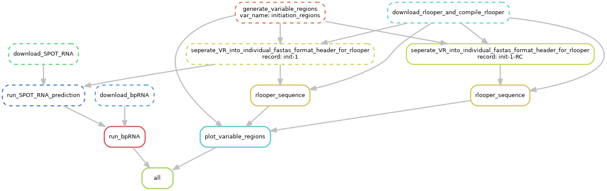

# Plasmid design for investigating sequence effect on R-loop initiation and termination


## Dependencies

The workflow is intended to be run on a unix system, I ran on a Ubuntu server.
The vast majority of software dependencies for the workflow are handled by
snakemake and conda. That being said you will need both snakemake and conda
installed.

However there are some programs that will need to be configured / installed
before running. 

### Perl and required libraries

The workflow currently assumes you have the perl language installed and that
the `Graph.pm` module is available for local import using `local::lib`. You can
install [Graph.pm](https://metacpan.org/dist/Graph/view/lib/Graph.pod)
using the command `cpanm Graph`. 


## Grant language

Language taken directly from grant describing the work.

### Analyzing initiation sequences

```
To identify characteristics of R-loop initiation regions, we will syn-thesize 20 versions of a 200 bp initiation fragment cloned
immediately downstream of a promoter (T7 or the E. coli tac promoter). These 20 sequences will represent all combinations resulting from varying GC content (40, 50, 60 and 70%) and GC skew (0, 0.1, 0.2, 0.4, and 0.6). Each sequence will be followed by a constant 300 bp R-loop extension region (50% GC and 0.2 GC skew)
```

and


```
We will next design substrates to systematically test the notion, reported in the literature, that G clustering is essential for initiation [27]. For this, we will use favorable initiation regions (60% GC content with GC skew of 0.4) and arrange the fixed number of guanines on the displaced strand in G clusters of sizes 1, 2, 3, or 4. Given reports that GA-rich sequences favor R-loop formation [22], we will test the effect of AT skews for the first time by introducing AT skews of 0, 0.2, and 0.4 in addition to G clustering.
```

### Analyzing termination sequences

```
We will add a constant extension region of 100 bp, and synthesize and clone a series of 200 bp sequences immediately thereafter. These potential termination regions will possess decreasing GC content (50, 40, 30%) and decreasing GC skew (0, -0.2, -0.4), thus producing increasingly unfavorable contexts for RNA:DNA base-pairing. We will test the effect of C clustering and negative AT skews, as described above for initiation
```

## Running the workflow

Workflow is run via snakemake.



Ways to execute workflow

`snakemake -j 1 --use-conda`

Edit the `run.sh` and `cluster.yml` files for your computing environment.
Then make `run.sh` executable and run the workflow by calling `./run.sh`.

### Specifying variable region parameters

Create a csv file in the `variable_defs` directory with the fields listed below.
| Field name                |       Description                                                                                                                                       |
| ------------------------- | -----------------------------------------------------------------------------------------------------------------------------------------------------   |
| name                      | Name of the variable region, no spaces and not underscores!                                                                                                                 |
| length                    | Length ofregion in nucleotides.  |
| gc_content                | GC content, float between 0 and 1. |
| gc_skew                   | GC skew, float between -1 and 1. |
| at_skew                   | AT skew, float between -1 and 1. |
| at_content                | AT content, float between 0 and 1. |
| cluster_length            | If the variable region is to have clusters of nucleotides set to the length of each cluster in nucleotides. Also then requires specifying the cluster_nuc field. |
| cluster_nuc               | Nucleotide that will compose clusters. |
| clustering_mode           | Way in which clusters should be placed in the variable regions.  |
| reverse_complement        | Calculate sequence statistics for the reverse complement of the specified sequence. Set to 1 to trigger reverse complement calcs or 0 otherwise. |
| role                      | Short description of role of variable region. This will appear in fasta headers generated from this region. No spaces!                                  |

If a field is not specified is should be set to `NA`.

#### Currently available clustering methods

##### `find_available_random_range`

Places each cluster randomly in the variable region sequence so that clusters
do not overlap.

### Example output

All output will be written to a directory called `output` located
where ever the workflow is executed. Below is example directory structure
after executing the workflow with two variable region definition tsv files.

```
.
├── initiation_regions
│   ├── files
│   │   ├── initiation_regions.fasta
│   │   └── initiation_regions.tsv
│   └── plots
│       └── initiation_regions.pdf
└── termination_regions
    ├── files
    │   ├── termination_regions.fasta
    │   └── termination_regions.tsv
    └── plots
        └── termination_regions.pdf
```

#### Fasta

Fasta formatted file of all generated variable regions.

```
>VR_Init_1_initiation_region_1_GCskew:0.1_GCcontent:0.4_ATskew:0.1_ATcontent:0.6_Clustered:False
CATATGGAATAGGACTTAAACTCACTGCCGACTAGCCGACCATGATTTACACTCTCTACAGTTCGAACTTACGGGGTCCT
GTAGTTGCTTATAATTGTCCGGCTGAATTCATATATATGCGTTTTAGTGCATATTTTTCCACACAAGATTTCTCGTAGTT
TACGACCATATAAGCCGAACCGGTTGATTTATCGTTACAA
>VR_Init_2_initiation_region_2_GCskew:0.4_GCcontent:0.7_ATskew:0.4_ATcontent:0.30000000000000004_Clustered:False
CACCGCCCCCCCCGCTGCTCGACCGAAGTATCGCCTGCGCTCCCCCTGCTACGCACCTTCCCACCTTCCGTGCGCAATCG
CTCCGCCTTGTACGCTCGCCCATGCCGGAGTGCCTCGTCCCACCGCATTCCGTCCCACCCCGCTCCGTTGGGCTCGCCAC
CCCTCCCCTGCCTCTTTACCTTCTGGGGTTCCGGCGCCTG
```

#### TSV

Tab seperated file of all generated regions, used mainly for plotting.

```
name	GC_content	GC_skew	AT_content	AT_skew	Cluster_length	Clustered_nucleotide	Clustering method	Sequence
VR_Init_1_initiation_region_1_GCskew:0.1_GCcontent:0.4_ATskew:0.1_ATcontent:0.6_Clustered:False	0.4	0.1	0.6	0.1	NA	NA	find_available_random_range	CATATGGAATAGGACTTAAACTCACTGCCGACTAGCCGACCATGATTTACACTCTCTACAGTTCGAACTTACGGGGTCCTGTAGTTGCTTATAATTGTCCGGCTGAATTCATATATATGCGTTTTAGTGCATATTTTTCCACACAAGATTTCTCGTAGTTTACGACCATATAAGCCGAACCGGTTGATTTATCGTTACAA
VR_Init_2_initiation_region_2_GCskew:0.4_GCcontent:0.7_ATskew:0.4_ATcontent:0.30000000000000004_Clustered:False	0.7	0.4	0.30000000000000004	0.4	NA	NA	find_available_random_range	CACCGCCCCCCCCGCTGCTCGACCGAAGTATCGCCTGCGCTCCCCCTGCTACGCACCTTCCCACCTTCCGTGCGCAATCGCTCCGCCTTGTACGCTCGCCCATGCCGGAGTGCCTCGTCCCACCGCATTCCGTCCCACCCCGCTCCGTTGGGCTCGCCACCCCTCCCCTGCCTCTTTACCTTCTGGGGTTCCGGCGCCTG
```

#### Plots

Plots produced for one variable region.


There is currently a bug that prints sequence text twice. Not sure what is
causing this as the double printing is not limited to sequence
but any string that is passed to `ggparagraph` and then plotted
in that position.


#### Plasmid selection

The sequences generated are random nucleotide sequences that satisfy user
defined parameters. This can lead to significant variation in local sequence
properties between two variable regions specified with the same global parameters.
In order to pick the "best" possible variable regions, regions can be further
selected based on the attributes described below.

##### Min and max standard deviation in skew and content


##### Number of standard deviations from RNA secondary structure expectations

It is likely that significant RNA secondary structure would decrease the likelihood
of R-loop formation by sterically preventing hybridization to the DNA template.
Therefore it is desirable to try and reduce the degree of secondary structure
that might form over a given variable region. To do this the workflow uses
[SPOT-RNA](https://github.com/jaswindersingh2/SPOT-RNA) to predict RNA secondary
structure and a modified version of [bpRNA](https://github.com/EthanHolleman/bpRNA)
to translate those predictions into secondary structure annotations. 

A variable region's secondary structure is accessed with two basic metrics. The
proportion of unpaired ribonucleotides (unpaired ribos / all ribos) and proportion
of sequence in hairpin structures (hairpin ribos / all ribos). An expectation
for what a "good" or "bad" variable region might look like with respect to
secondary structure was formed by generating 500 random sequences of various
lengths, predicting RNA secondary structure using SPOT-RNA and plotting
results as distributions shown below. 


##### Max local average energy and min R-loop probability

Ideally, we would like to know that sequences used in variable regions
will be capable of forming R-loops. [Rlooper](https://github.com/chedinlab/rlooper), 
a physics based model of R-loop formation can help answer this question. Rlooper
calculates both the probability of R-loop formation and the sequence energetics
for a given nucleotide sequence. Again, in order to determine what values might
separate "good" from "bad" variable region sequences 500 random sequences of 
various lengths were generated and then accessed using Rlooper to build an
expectation. The results of the simulations are shown below.


## Known bugs

- R script `plot.R` generates an extra blank page for each plot
- R script `plot.R` duplicates nucleotide sequence when rendered to page
  using `ggparagraph`. This occurs for *any* string not just the nucleotide seq. 